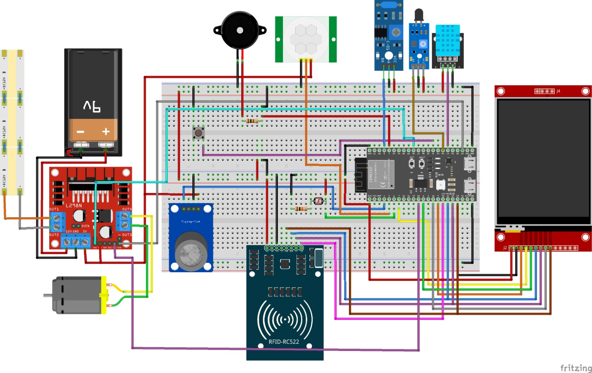

# SmartLab Assistant — AI-Based Laboratory Security Agent

> An intelligent agent for university laboratory security and environmental monitoring,  
> designed and implemented using the **PEAS framework** (Performance, Environment, Actuators, Sensors).

---

## Course Information

| | |
|---|---|
| **Course** | Artificial Intelligence — Final Project |
| **University** | Recep Tayyip Erdoğan University, Computer Engineering |
| **Lecturer** | Dr. Joseph Bamidele Awotunde |

## Group Members

| Name | Student ID |
|---|---|
| Şevval Asi | 221401026 |
| Durdane Naz Babaoğlu | 221401028 |
| Mert Abdullahoğlu | 221401005 |
| Abdul Samed Kara | 211401065 |

---

## Project Overview

SmartLab Assistant is an AI-based intelligent agent that monitors a university computer engineering laboratory in real time. The system detects security threats (unauthorized access, fire, dangerous gas levels), controls environmental actuators (fan, LED strip), and identifies authorized users via RFID.

The project is built on a real **ESP32-S3** embedded system with 7 physical sensors and 4 actuator systems. The Python simulation faithfully mirrors the decision logic running on the hardware, and can also connect directly to the ESP32 via HTTP to operate with live sensor data.

The agent is designed using the **PEAS framework**, which ensures goal-oriented, measurable, and intelligent behavior.

---

## PEAS Framework

### Performance Measure (P)
How success is evaluated:

| Metric | Description |
|---|---|
| Correct Detections | Threat present AND alert raised |
| False Alarms | No threat BUT alert raised |
| Missed Detections | Threat present BUT no alert raised |
| Correct Ignores | No threat AND no alert raised |
| Overall Accuracy | (Correct Detections + Correct Ignores) / Total Steps |
| Avg Response Time | Mean time from perception to action (ms) |

### Environment (E)
The university laboratory with the following characteristics:

| Characteristic | Description |
|---|---|
| Partially Observable | Not all events visible simultaneously |
| Dynamic | Conditions change continuously |
| Stochastic | Uncertainty in sensor readings |
| Real-Time | Requires immediate decision-making |

Possible environment states: authorized user / unauthorized user / no user, smoke levels (clean / moderate / dangerous), temperature (normal / high), flame, vibration, light level (bright / dim / dark).

### Actuators (A)

| Actuator | Hardware | Action |
|---|---|---|
| Fan | L298N motor driver + DC fan | 0% / 50% / 100% PWM |
| TFT Display | ILI9341 240×320 | Status, alerts, user name |
| Speaker | Buzzer | Voice alerts |
| LED Strip | L298N channel A | Proportional brightness (LDR-based) |
| Web UI | HTTP server | Remote monitoring and control |

### Sensors (S)

| Sensor | Hardware | GPIO | Data |
|---|---|---|---|
| RFID Reader | MFRC522 (SPI) | CS=GPIO10 | User identity (UID → name) |
| Smoke / Gas | MQ135 (ADC) | GPIO4 | Concentration: clean / moderate / dangerous |
| Temperature & Humidity | DHT11 | GPIO47 | °C, % — fan triggers at >27°C |
| Flame | Flame sensor (digital) | GPIO48 | Fire detection (active LOW) |
| Vibration | SW-420 | GPIO1 | Physical disturbance |
| Light | LDR (ADC) | GPIO6 | Ambient light for LED control |

---

## Hardware

### Circuit Diagram



> Built with Fritzing. ESP32-S3 center, L298N motor driver (fan + LED strip) left,  
> ILI9341 TFT right, RFID-RC522 bottom, MQ135 + DHT11 + flame + SW-420 top.

### Components

- **ESP32-S3 N16R8** — main microcontroller (16MB Flash, 8MB PSRAM)
- **ILI9341 TFT 240×320** — SPI display (LVGL 8-state UI)
- **MFRC522** — RFID reader (SPI, shared bus)
- **MQ135** — smoke/gas sensor (ADC1_CH3)
- **DHT11** — temperature and humidity sensor
- **Flame sensor** — digital IR flame detector
- **SW-420** — vibration sensor
- **LDR** — light-dependent resistor (ADC1_CH5)
- **L298N** — dual motor driver (fan PWM + LED strip PWM)
- **DC fan** — 5V ventilation fan
- **LED strip** — 12V ambient lighting
- **Buzzer** — audio alerts

---

## Software Architecture

```
smartlab-peas/
├── smartlab_agent.py   — Core agent: all PEAS classes + terminal simulation
├── smartlab_gui.py     — Tkinter GUI (wraps smartlab_agent.py)
├── peas_document.md    — PEAS framework documentation
└── learned_state.json  — EMA learning state (auto-generated on first run)

esp32-firmware/
├── main/main.c         — ESP32 HTTP server + sensor tasks
├── main/rfid.c/h       — MFRC522 bare-metal driver
├── main/smoke_sensor.c — MQ135 ADC + debounce
├── main/dht11.c        — DHT11 driver
├── main/fan_control.c  — LEDC PWM fan
├── main/led_strip_ctrl.c — LEDC PWM LED strip
└── main/ui/            — LVGL TFT state machine
```

### Python Class Structure

```
LabEnvironment   — simulates lab state (E)
Sensors          — reads from simulated environment (S)
RealSensors      — reads live data from ESP32 via HTTP (S)
Preprocessor     — cleans and normalizes raw readings
Analyzer         — classifies processed data into events
Actuators        — executes actions (print) (A)
RealActuators    — sends HTTP POST commands to ESP32 (A)
EMALearner       — adaptive threshold learning (Step 7)
SmartLabAgent    — decision making + performance tracking (P)
```

---

## Algorithm Flow

```
Step 1 — Initialize  : load authorized users, set ARMED mode, load learned_state.json
Step 2 — Perceive    : raw sensor readings (RFID, smoke ADC, temp, flame, vibration, light)
Step 3 — Preprocess  : clamp ADC values, apply noise floor filter, use learned thresholds
Step 4 — Analyze     : classify → identity / smoke / thermal / security / environment
Step 5 — Decide      : priority rule engine (see below)
Step 6 — Act         : fan PWM, TFT display, speaker, LED strip, web UI
Step 7 — Learn       : EMA update on non-threat readings → persist to learned_state.json
```

### Decision Priority

| Priority | Condition | Actions |
|---|---|---|
| 1 | Flame detected | Fan 100%, EVACUATE alert, speaker, web notify |
| 2 | Smoke dangerous (>1500 ADC) | Fan 100%, smoke alert, speaker, web notify |
| 3 | Smoke moderate (800–1500 ADC) | Fan 50%, status update |
| 4 | Temperature high (>27°C) | Fan 50%, status update |
| 5 | Unauthorized RFID | ACCESS DENIED, TFT alert, web notify |
| 6 | Authorized RFID | Welcome message on TFT |
| 7 | Light level | LED brightness proportional to LDR |

---

## Adaptive Learning (Step 7)

The agent uses **Exponential Moving Average (EMA)** to learn the normal baseline for smoke ADC and temperature, and sets thresholds dynamically:

```
threshold_smoke_moderate  = max(800,  mean_smoke + 2σ)
threshold_smoke_dangerous = max(1500, mean_smoke + 4σ)
threshold_temp_high       = max(27.0, mean_temp  + 2σ)
```

- **Updates only on non-threat readings** — avoids drifting toward danger as "normal"
- **Persists to `learned_state.json`** — knowledge survives restarts
- **Safety floors** — thresholds never drop below hardware-validated minimums
- **False alarm streak detection** — 3+ consecutive false alarms triggers threshold review

---

## How to Run

### Simulation Mode (no hardware needed)

```bash
cd smartlab-peas

# Terminal simulation
python -X utf8 smartlab_agent.py

# Tkinter GUI
python -X utf8 smartlab_gui.py
```

Requirements: Python 3.8+, standard library only (no pip install needed).

### Real Hardware Mode

Python connects **directly to the ESP32 HTTP server** — no intermediate server required.

**Step 1 — Flash the ESP32 firmware:**
```bash
cd esp32-firmware
get_idf
idf.py -p COMX flash monitor
```

**Step 2 — Note the IP printed on serial monitor.**  
Update if changed (near top of `smartlab_agent.py`):
```python
ESP32_HOST = "10.162.138.1"
```

**Step 3 — Run:**
```bash
cd smartlab-peas

# Terminal
python -X utf8 smartlab_agent.py --real

# GUI — press "Switch Real/Sim" button after launch
python -X utf8 smartlab_gui.py
```

If ESP32 is unreachable, the agent automatically falls back to simulation mode.

### ESP32 HTTP Endpoints

| Method | Endpoint | Description |
|---|---|---|
| GET | `/sensors` | `{temperature, humidity, smoke, ldr, flame, vib}` |
| GET | `/status` | `{username, rfid_scanned}` |
| POST | `/fan` | `{"speed": 0-100}` |
| POST | `/led` | `{"brightness": 0-100}` |

---

## GUI Controls

| Control | Description |
|---|---|
| **▶ Run Step** | Advance one decision cycle |
| **⏵ Auto Run** | Run automatically every 1.2 seconds |
| **↺ Reset** | Reset agent and all performance metrics |
| **Toggle ARMED/DISARMED** | ARMED: full alerts active \| DISARMED: monitoring only |
| **Switch Real/Sim** | Toggle between live ESP32 data and simulation |

